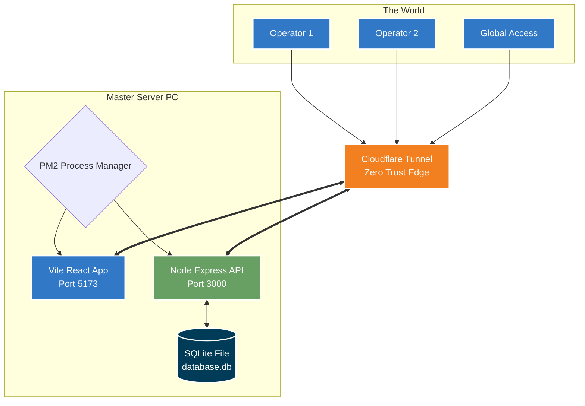

<div align="center">
  <h1>📊 Record Assistant</h1>
  <p><b>Enterprise-Level Task & Financial Management System</b></p>
  <p><i>A complete journey from conceptualization to global production deployment.</i></p>

  <!-- Badges -->
  
  
  
  
  
  
  
</div>

---

## 📖 Table of Contents
1. [Project Overview](#-project-overview)
2. [The Journey: Planning to Production](#-the-journey-planning-to-production)
    - [Phase 1: Architecture & Blueprint](#phase-1-architecture--blueprint)
    - [Phase 2: Core Engineering](#phase-2-core-engineering)
    - [Phase 3: Production & Security](#phase-3-production--security)
3. [Core Technical Features](#-core-technical-features)
4. [System Architecture](#-system-architecture)
5. [Getting Started](#-getting-started)

---

## 🌟 Project Overview

**Record Assistant** is a comprehensive, lightweight system built for multi-branch organizational management. It was created to solve a complex real-world problem: tracking financial settlements, daily operations, and task delegation across multiple physical locations without relying on heavy cloud database infrastructures. 

The application enforces a rigid, audited settlement process, ensuring accurate tracking of end-of-day balances and operator task assignments while maintaining strict role-based access control.

---

## 🚀 The Journey: Planning to Production

Building Record Assistant wasn't just about putting code together; it was a carefully orchestrated process from defining rigid business logic to deploying a secure, globally accessible application from a local master node.

### Phase 1: Architecture & Blueprint
The project began with a strict architectural philosophy: **Keep it fast, keep it localized, but make it universally accessible.**
- **The Constraints:** I needed a system that acts like a traditional heavy application (e.g., PHP/MySQL) but built on a modern stack. It was decided early on to bypass complex ORMs (like Prisma) and heavy databases (MySQL) in favor of the lightweight, lightning-fast native `node:sqlite`.
- **Role-Based Blueprint:** The core design principle was mimicking real-world hierarchy:
  - *Superadmin (CEO/Dev)*: Full system control, branch-agnostic.
  - *Admin (COO/Accountant)*: Branch-level management and ledger oversight.
  - *Operator (Coordinator)*: Execution-level, limited to task completion and financial logging.
- **Result:** A robust system blueprint defining entities, permissions boundaries, and rigid deployment rules.

### Phase 2: Core Engineering
With the blueprint set, development moved to the core mechanics. Focus was placed on stability and mathematical accuracy.
- **Advanced Multi-Settlement Logic:** Built a chained settlement engine. Users can settle their financial drawers multiple times daily. Each new settlement acts as a linked node, automatically pulling the "Kept Amount" from the previous session as the new "Opening Balance". 
- **Real-Time Financial Ledger:** Implemented a full audit trail capturing cost variations, pending records, and transaction timestamps, giving Admins a bird's-eye view of organizational cash flow across all branches.
- **Network-Agnostic Build:** Engineered the Vite frontend and Express backend to dynamically adapt to connection environments (localhost, local Wi-Fi, or global web) without requiring rebuilds or rigid hardcoded IP addresses. All network mapping is dynamic.

### Phase 3: Production & Security
The final challenge was deployment. How do we make a "local" application globally accessible to branch operators worldwide securely, without exposing the master server to the raw internet?
- **Process Management:** Leveraged `PM2` with an `ecosystem.config.js` to ensure the application runs 24/7 on the master node, surviving system reboots and crashes gracefully.
- **Zero-Trust Global Network:** Instead of port-forwarding and exposing server IPs to potential threats, I configured **Cloudflare Tunnels**. This creates an outbound-only connection to Cloudflare's edge network. Operators log in via a public `https://` domain, which securely tunnels directly to the locked-down master PC. 
- **Result:** Enterprise-grade security on a local-first application architecture.

---

## 🛠 Core Technical Features

| Feature | Technical Implementation |
| :--- | :--- |
| **Chained Settlements** | Local SQLite algorithms that prevent orphaned records by seamlessly linking multi-day/multi-session balances. |
| **Dynamic API Routing** | Frontend intercepts current `window.location.hostname` to auto-map backend API endpoints dynamically for local or remote clients. |
| **Role-Based Access Control** | Express middleware enforcing strict CRUD limitations based on user roles and authority boundaries. |
| **Silent Dev Panel** | Undocumented, highly secure UI components injected to allow deep data sanitization and test wiping without manual DB intervention. |
| **Instant Analytics** | Calculating financial variance `(price - cost)` entirely dynamically on entry, optimizing performance. |

---

## 🏗 System Architecture



---

## 🏁 Getting Started (For Reviewers & Devs)

If you'd like to inspect the code locally or run your own instance:

### 1. Prerequisites
- **Node.js**: v18+ LTS
- **PM2**: `npm install -g pm2`

### 2. Installation
```powershell
# Clone the repository
git clone https://github.com/SiddharthV277/RECORD-ASSISTANT.git
cd RECORD-ASSISTANT

# Install dependencies (Root, Backend, Frontend)
npm install
cd backend; npm install; cd ..
cd frontend; npm install; cd ..
```

### 3. Run the System
Fire up both the frontend and backend servers simultaneously:
```powershell
pm2 start ecosystem.config.js
```

### 4. Access Default Credentials
The system automatically populates a default Super Admin account on the initial run:
- **Email**: `admin@example.local`
- **Password**: `admin123`

---

<div align="center">
  <b>Architected & Developed by <a href="https://github.com/SiddharthV277">SiddharthV277</a></b><br>
  <i>Showcasing practical engineering and reliable deployment strategies.</i>
</div>
